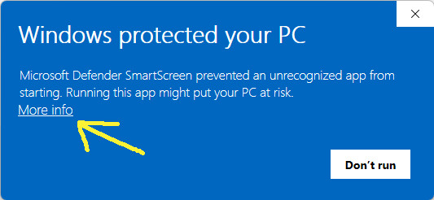
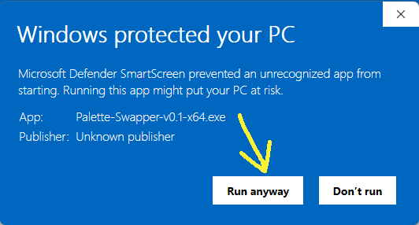

# PaletteSwapper
A simple palette swapper for batch replacing indexed color palettes in PNG files
`PaletteSwapper` is a tool designed to help pixel art artists and video game developers efficiently modify the color palettes of indexed PNG images in bulk.


## Features

- Batch color palette swapping for PNG images.
- Simple and easy-to-use graphical interface.
- Ability to use predefined palettes or load new ones.


## Getting Started

Building the application is not necessary to run it. You can choose to just install it or to build it from source, so choose one of the following sections accordingly.


### Installation

- Download the latest binaries from [GitHub releases](https://github.com/jjhaggar/PaletteSwapper/releases/latest). Save the executable file anywhere you want.
- Double-click on the executable file. Click on "More info". Then click on "Run anyway". This warning will only appear once.




### Compilation

- **Install Python.**

  To build this application, you need a working installation of Python. You can download it from [python.org](https://python.org).

- **(Optional but recommended) Set up a virtual environment.**

  It's highly recommended to use a virtual environment (such as Python's built-in venv, Conda, or Miniconda) to isolate the project's dependencies and avoid conflicts with other Python installations on your system.

  - Option A: Using Python's `venv`:

  ```
  python -m venv env
  source env/bin/activate       # On macOS/Linux
  .\env\Scripts\activate        # On Windows
  ```

  - Option B: Using Conda:

  ```
  conda create --prefix ./env python=3.9
  conda activate ./env
  ```

- **Install dependencies.**
  
  This project requires the Python packages `tkinterdnd2`, `Pillow`, and `PyInstaller`. You can install all of them with a single command in your terminal or Command Prompt:

  ```bash
  python -m pip install pillow tkinterdnd2 pyinstaller
  ``` 

- **Clone the repository.**

  You can clone the repository and go to the `source` directory with:

  ```bash
  git clone https://github.com/jjhaggar/PaletteSwapper.git
  cd PaletteSwapper/source
  ```

- **Build the application.** Run:

  ```bash
  pyinstaller --onefile --windowed --icon=palette_swapper_icon.ico palette_swapper.py
  ```

  After the build completes, the compiled executable should be available in the newly created `PaletteSwapper/source/dist` directory.


### Usage

To change the color palettes of your images:

- Open the application.
- Select the directory where your images are located.
- Choose the palette you wish to apply.
- Click 'Apply'.


## License

### Third party software

This project uses several open source libraries, listed next with their respective licenses:

- **Python & Tkinter**: [Python Software Foundation License](https://docs.python.org/3/license.html)
- **Pillow**: [Historical Permission Notice and Disclaimer](https://github.com/python-pillow/Pillow/blob/master/LICENSE)
- **PyInstaller**: [GNU General Public License (GPL)](https://www.gnu.org/licenses/gpl-3.0.html)

Thanks to all of their developers.

### License of this software

This project is licensed under the [MIT License](https://opensource.org/licenses/MIT) - see the [LICENSE](LICENSE) file for details.


## Current Version

### **Version 0.1** - This initial version includes:

- Basic functionality to batch change color palettes of indexed PNG images.
- Simple graphical user interface for easy operation.
- Ability to select and apply a single predefined palette.

## Future Features

I am planning to add the following features (hopefully):

- **Graphical Previews**: Ability to preview changes before applying them.
- **Recursive Folder Search**: Automatically apply palette changes to images in nested folders.
- **Tooltips and Help Manual**: To improve user experience by providing helpful tips and a detailed user manual.
- **Multiple Palettes**: Support for loading and using multiple palettes at once.
- **More image and palette formats**: Support for loading and using more formats (gif, pal, act, etc.).
- **Multilanguage Support**: To make the application accessible to a broader audience.
- **Preference Saving**: Users will be able to save their settings for future use.
- **Builds for macOS and Linux**: Expanding compatibility to include more operating systems.


## Contact

- Created by JJHaggar - Feel free to tweet me at [@JJHaggar](https://twitter.com/jjhaggar)!


